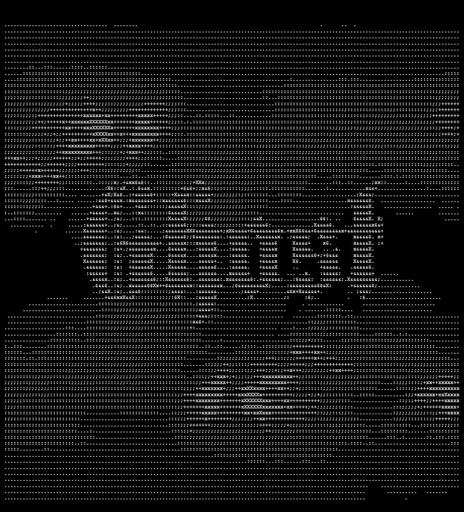

# GHOST

C++ implant for [AETHER](https://github.com/ENIX1701/AETHER) deployable to Linux hosts.

## Prerequisites

- `C++20`
- `CMake` (`3.14+`)
- `Make`
- `cpr` and `nlohmann_json` (automatically fetched via *CMake*)

## Build locally

GHOST uses CMake for its build system. The compilation is highly parametrized and enables you to build an implant tailored exactly to your use case. For more information on that, please visit the [build guide](docs/BUILD.md).

```bash
# create and navigate to build directory
mkdir build
cd build

# configure and build
cmake ..
make
```

The resulting executable will be located at `build/bin/Ghost`.

## Deploy

### AETHER (recommended)

In a standard AETHER deployment, GHOST is built and deployed via the C2 infrastructure. For detailed instructions on that please visit [AETHER's README](https://github.com/ENIX1701/AETHER/blob/main/README.md).

### Manual

To deploy a GHOST to the system of your choice (that you, of course, **are authorized** to test), just put the binary created in [build](#build-locally) step onto the Linux host and run it.

Production builds follow the same instructions as the [local builds](#build-locally), but usually use different flags, often to simulate certain scenarios. For more details on compilation flags visit the [build guide](docs/BUILD.md).

## Testing

GHOST includes a CMake test suite to verify it builds correctly with different argument permutations.

```bash
mkdir build
cd build

cmake -DENABLE_TESTING=ON ..
ctest -j4 --output-on-failure   # -j option makes this run in parallel, use as many cores as you want
```

## Architecture

GHOST is a modular agent. It's easy to extend. For detailed information on its architecture, please visit the [architecture deep-dive](docs/ARCHITECTURE.md). Check out [code guidelines](docs/CODE_GUIDELINES.md) if you're more interested in implementation details.

## Roadmap

- [ ] Fully implement `IModule->reverse()` for automated artifact cleanup
- [ ] Further parametrize payloads
- [ ] Implement at least 3 distinct techniques in each tactic:
    - [ ] Persistence
    - [ ] Discovery
    - [ ] Collection
    - [ ] Impact
- [ ] Track tactics as *Mitre ATT&CK* codes (as build parameters for example)
- [ ] Threat-actor inspired testing scenarios

## Contributing

You're so cool :3 Head over to the [architecture](docs/ARCHITECTURE.md) and [code guidelines](docs/CODE_GUIDELINES.md) sections to get started! There are instructions on how to implement new modules and methods. When you're done, create a pull request and we'll polish your work and merge it into the main branch!

## Legal

> [!IMPORTANT]
> This software is for educational purposes and authorized red team engagements only. The authors are not responsible for misuse.

---

Special thanks to [awesome-readme](https://github.com/matiassingers/awesome-readme) for README ideas and to [readme.so](https://readme.so/) for helping me make this one coherent at all :3
